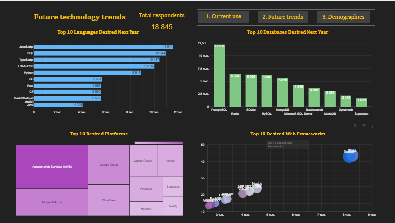
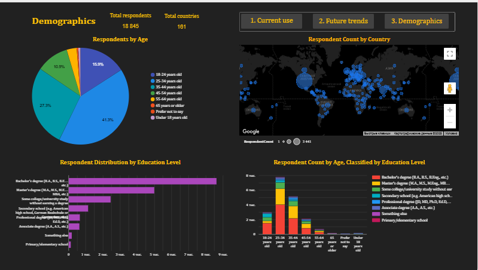

@"
# Tech Survey Dashboard 2024

📊 Interactive dashboard analyzing technology trends among 18,845 developers from 161 countries.

## Features
- 3 interactive dashboard pages
- 12+ visualizations
- BigQuery backend
- Looker Studio frontend
## Dashboard Pages

### 1. Current Technology Usage

### 2. Future Technology Trends

### 3. Demographics

## Live Dashboard
🔗 [View Interactive Dashboard](https://lookerstudio.google.com/reporting/83b5e7e6-015b-4dcf-aab3-b3fb17d7943a)

## Technology Stack
- Python 3.8+
- Google BigQuery
- Looker Studio

## Project Structure
- scripts/ - Python data processing
- bigquery/ - SQL views and queries
- looker_studio/ - Dashboard documentation
- data/ - Processed data files

## Quick Start
1. Install dependencies: pip install -r requirements.txt
2. Configure .env file
3. Run: python scripts/02_prepare_data.py
4. Upload to BigQuery: python scripts/03_upload_to_bigquery.py

## Author
cherta285

## License
MIT
"@ | Out-File -FilePath README.md -Encoding UTF8
